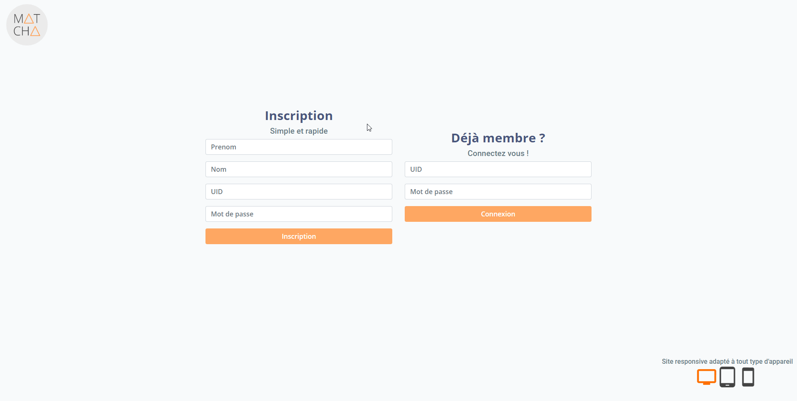
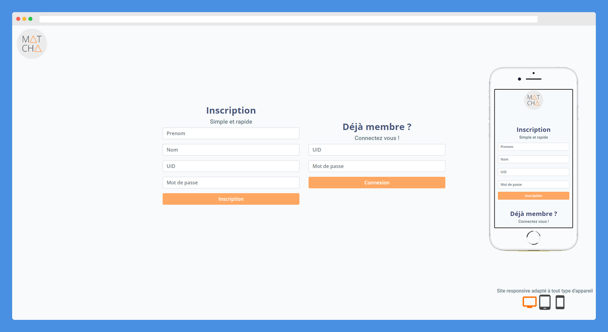

# MATCHA Project

The MATCHA project est un projet final d'étude qui vise à automatiser un système de gestion de carte de bus.

## Demo Site Web
 

## Responsive


## Hardware

| Module                          |       Fonction      |
|---------------------------------|:-------------------:|
| DFR0021-R                       | LED rouge           |
| DFR0021-G                       | LED verte           |
| DFR0032                         | Buzzer              |
| GDM2004D                        | Ecran               |
| CLCD-216                        | Convertisseur écran |
| SM130                           | Module RFID         |
| SparkFun RFID Evaluation Shield | RFID Board          |
| MF1 IC S50                      | Carte 1k stockage   |

## Technologies utilisées

* C++
* Python 3.8
* Flask
* SQLAlchemy
* SQLite

## Utilisation

matcha.py => Script gestion requêtes bdd

server.py => Script Flask backend

RFID.ino => Script arduino gestion écran, buzzer, led, RFID

Lien d'accès serveur local :

```
localhost:5000
```

## Contributing
Projet réalisé avec l'aide de Maxime et Anthony
